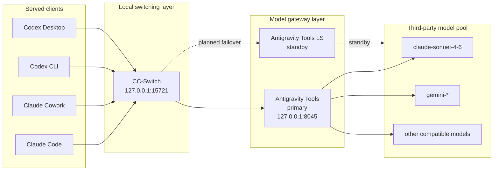
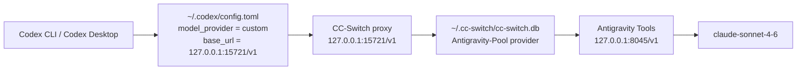

# Dogegate Architecture

Dogegate is a reusable configuration layer for routing local coding agents
through CC Switch and Antigravity Tools.

The first shipped version productizes the Codex path. The broader system also
serves Claude Code and Claude Cowork, which are already proven locally and are
planned for installer support in a later release.

## System Map



## Current v0.1.0 Scope



## Roles

| Component | Role | Current state |
| --- | --- | --- |
| Antigravity Tools | Primary upstream model gateway. | In use |
| Antigravity Tools LS | Standby upstream gateway for later failover support. | Standby |
| CC-Switch | Local proxy, provider switcher, and live config takeover layer. | In use |
| Claude Code | Coding agent client routed through the shared proxy stack. | Proven locally, not automated in v0.1.0 |
| Claude Cowork | Companion coding agent client routed through the shared proxy stack. | Proven locally, not automated in v0.1.0 |
| Codex CLI | Codex command-line client. | Automated in v0.1.0 |
| Codex Desktop | Codex desktop app. | Automated in v0.1.0 |

## Why Codex Needs Special Handling

Recent Codex builds do not reliably use a custom endpoint when only these
top-level fields are present:

```toml
base_url = "http://127.0.0.1:15721/v1"
wire_api = "responses"
```

Codex can still treat the provider as `openai`, then attempt the official API
or official login path. The working shape is:

```toml
model_provider = "custom"
model = "claude-sonnet-4-6"
review_model = "claude-sonnet-4-6"

[model_providers.custom]
name = "Antigravity-Pool"
base_url = "http://127.0.0.1:15721/v1"
wire_api = "responses"
```

Dogegate writes that shape into Codex live config and makes sure CC-Switch's
provider template points to the real Antigravity upstream:

```toml
[model_providers.custom]
base_url = "http://127.0.0.1:8045/v1"
wire_api = "responses"
```

The two addresses must not be the same:

- Codex talks to CC-Switch at `15721`.
- CC-Switch talks to Antigravity Tools at `8045`.

If both are `15721`, CC-Switch forwards to itself and Codex enters a reconnect
loop.

## Configuration Surfaces

Dogegate patches these local files and records backups before changing them:

| Path | Purpose |
| --- | --- |
| `~/.codex/config.toml` | Codex live provider config. |
| `~/.cc-switch/cc-switch.db` | CC-Switch provider templates, common Codex config, and live backup. |
| `~/.cc-switch/settings.json` | Current Codex provider selection. |

## Version Roadmap

| Version | Goal |
| --- | --- |
| `0.1.x` | Stable Codex CLI/Desktop routing through CC-Switch and Antigravity Tools. |
| `0.2.x` | Add Claude Code and Claude Cowork configuration support. |
| `0.3.x` | Add Antigravity Tools LS failover and health checks. |
| `1.0.0` | Compatibility matrix, rollback command, and tested multi-client profiles. |

